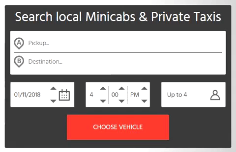

Last year, Nick came to us with an idea for an app to book airport pick up and drop for the UK market. The idea represented a chunk of market with substantial untapped potential and little competition until that point. We decided to do a rapid MVP to see how it could work in real life. We planned the MVP with all the right features, which were designed and tested specifically for the target customer base. It had the right functionality, the right marketing strategy, and there was a lot of initial interest. But the interest tapered off soon, and the indications all pointed to the concept having failed.

Just in the nick of time, our team figured out that it was the search box that the customers were having difficulty with. Even though it was a perfectly adequate search feature, the customers - who were used to amazing search suggestions from applications like Google Search and Google Maps - found it cumbersome and inconvenient to use. Once we changed the search feature to include auto suggestions and the search experience matched their expectations, we were back on track. This paved the way for better engagement, which enabled us to finally collect enough effective feedback for the next iteration. This experience taught us a valuable lesson about Minimum Viable Product and its limitations.

### What is a Minimum Viable Product?
It is broadly defined as the smallest thing that allows you to capture the maximum validated learning from customers with minimum effort.
### What is it not?
It is not a crude first version of the finished product, nor is it overloaded with features.
### What is it supposed to do?
It should deliver value to the customer. The learning derived from it should help build towards the unique solution that has been envisioned to solve your customers’ problem.

*“An MVP is a down payment on a larger vision.” — Johnny Holland*

This simple statement explains it all. Your MVP is not just a trimmed down version of your final product, but rather a strategy and a process that is aimed at putting you directly in the market with the least risk to gather most learning. So far, so good. 

Now here’s what an MVP is supposed to deliver:

- Deliver your product to the market in the shortest possible time
- Enable you to test the demand for the product
- Reduce cost of implementation
- Minimize losses incurred through failure 
- Put you in direct contact with the market
- Gather valuable data on customer behavior and preferences
- Gather and expand your customer base

### Why is it not enough?
MVP works best when treated like a learning vehicle, but here’s the snag. You see, while the design phase focuses on the minimum features required to convey the concept, it can often fail to take into account the user’s minimum expectation. So, while the product is perfectly capable of providing solution or generating interest, it could still end up being deemed cumbersome or inconvenient by the end user. This is especially true when the customer is accustomed to a certain level of experience and has already set their bar high on that front.

For instance, the MVP is an app that offers only two modes of payment while the customers have already learnt to expect multiple payment options through other products/services they use. When a single but crucial point such as the number of options for payment or log in options falls short of their expectation, the entire MVP could be deemed inconvenient by the customer. This skews the feedback, making it more difficult to gather data on the aspects which are crucial for bringing the product closer to the final vision. Keeping in mind the **minimum viable experience** allows businesses to sidestep this flaw.

### Minimum Viable Experience
Along with MVP, the minimum viable experience should also be factored in during the design phase. It is important to consider the customer’s journey and check if each feature is aligned with it. Consider whether each feature delivers on the minimum expectation that the customer has cultivated from their experience with similar solutions. A product with fewer features that are convenient and work beautifully is better than one with features that do not contribute to the user experience, or worse, one that delivers an inconsistent experience.

A product which is focused on enhancing user experience with well-designed features that work well, keeps the customers coming back for more. It also makes them more likely to recommend it to others enhancing the user base. Most importantly, it enables better data collection and a subsequently better product in the next iteration.

### Takeaway    
Not taking into account minimum viable experience in the design phase, and only designing an MVP with minimum possible features to fulfill its functional goals can lead to a potentially disastrous outcome for the product. It can negatively impact user engagement. The feedback that is gathered in such cases is often ineffective because it is focused on the inconvenience of trivial features instead of the ones that are actually designed to solve the customers’ problem. When feedback is scarce or insufficient, it could even lead to a false negative outcome for the whole project. The takeaway from our experience with the ride booking app was that while designing an MVP, we will now consider customer expectations on every aspect of the product and ensure that the experience is definitely more than bare minimum.
